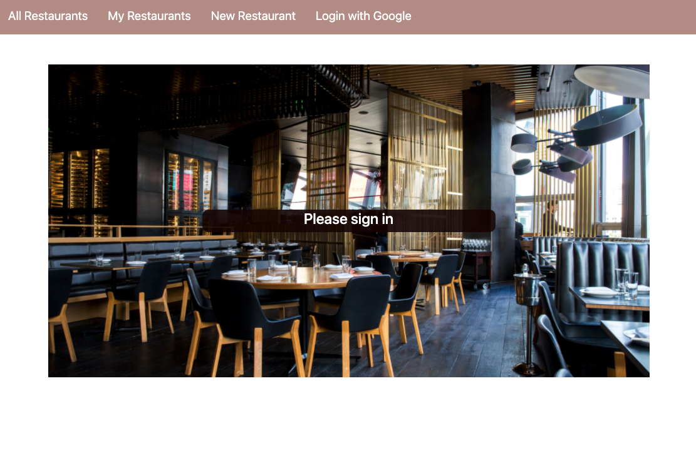
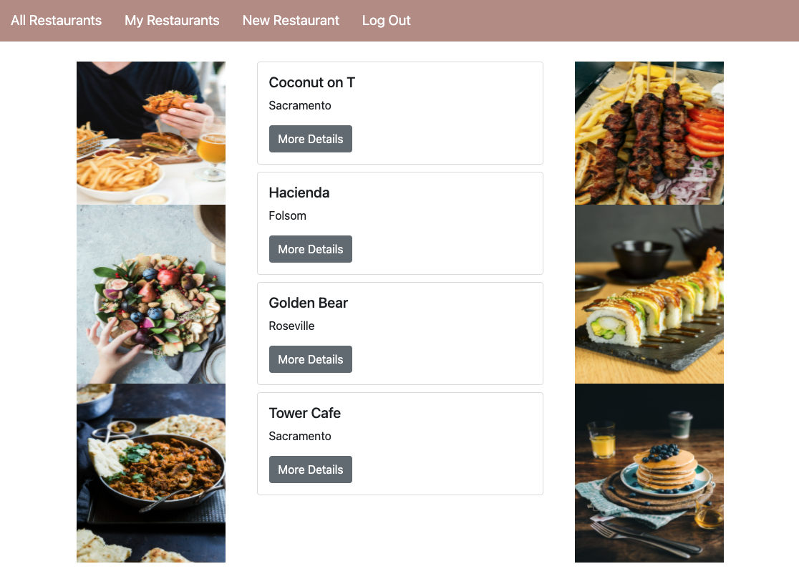

# Restaurant Tracker 

This app allows the users to manage their favorite, or least favorite, restaurants. It includes features to add your own review for a specific restaurant and see reviews from other users.

## Screenshots

## Technologies Used 

- HTML
- CSS
- JavaScript
- Node
- Express
- Mongoose
- MongoDB

## Getting Started

[Click here to launch the app](https://restaurant-tracker1.herokuapp.com/)

[Click here to launch my Trello board](https://trello.com/b/PkGw1kwe/project-2)

## Next Steps

Although the MVP is complete, there are many feautures that I would like to add. Here are my next steps for continuing to improve this app: 

1. Highest rated restaurants will show on top of the page
2. Filter reviews by rating/location
3. Allow users to add their own pictures 
 
